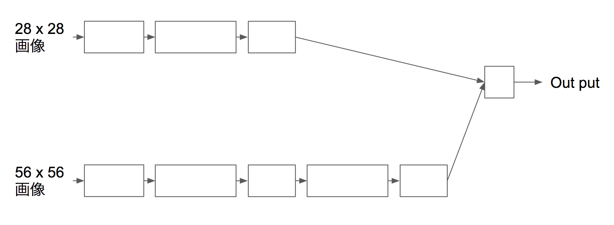

# Pytorch "Define by run"

It is easy to understand for "Define by run"

## Getting Started

"Define by run" is the easy to change network

 Example case is below



### Prerequisites

You have to setup the pytorch, you will access follow link.

http://pytorch.org/

## Running the code

```
python mnist_define_by_run.py
```

## Authors

[SnowMasaya](https://github.com/SnowMasaya)

## License

This project is licensed under the MIT License - see the [LICENSE.md](LICENSE.md) file for details

## References

[PyTorch documentation](http://pytorch.org/docs/master/index.html)


